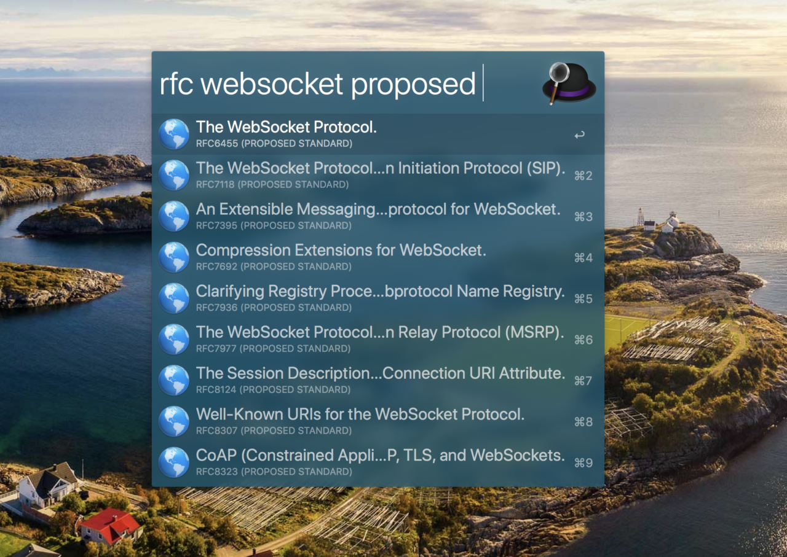
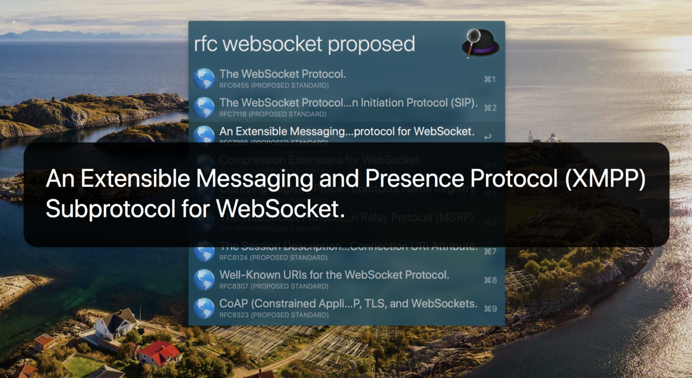

# Alfred RFC

Search RFCs using alfred

## Installation

1. `pip install -U alfred-rfc`
2. Download [SearchRFCs.alfredworkflow](https://github.com/weaming/alfred-rfc/blob/master/SearchRFCs.alfredworkflow?raw=true) and install it.
3. Modifiy the `$PATH` in installed workflow detail script filter if needed.

## Screenshots

* Search by keywords

* `⌘+L` show full title detail

* `⌘+c` copy link
* `⌘+y` quick view the link without open it in browser

